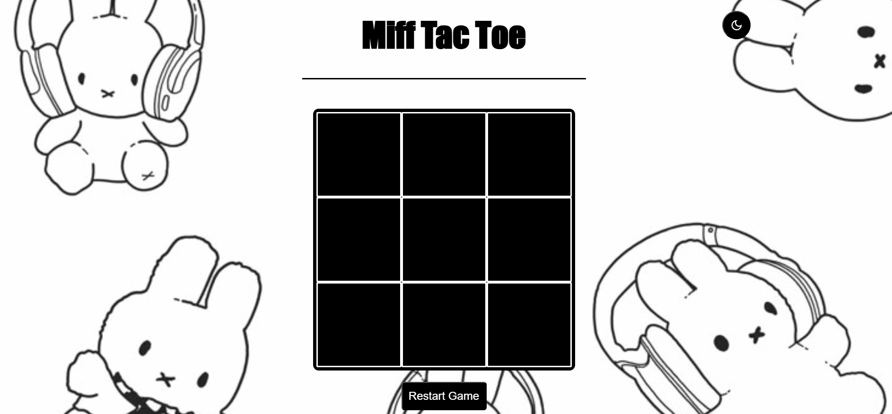
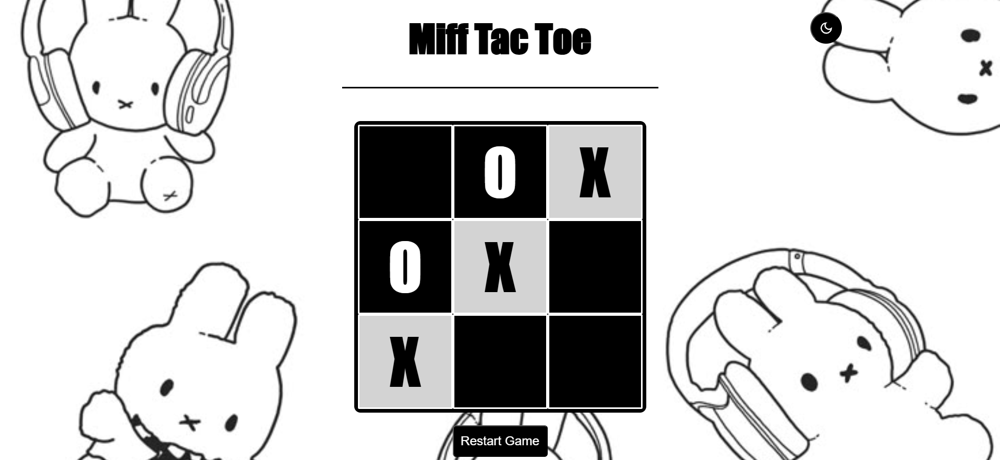

# 🐰 Miff Tac Toe

Miff Tac Toe is a fully functional, browser-based Tic Tac Toe game built with **HTML, CSS, and JavaScript**.  
It features **light and dark mode**, smooth gameplay, and a custom background inspired by **Miffy**, a character I really love.

This project focuses on DOM manipulation, game logic, and theme toggling using CSS variables.

---

## ✨ Features
- Fully playable Tic Tac Toe game
- Light mode & dark mode toggle
- Persistent theme using `localStorage`
- Visual win highlighting
- Restart game functionality
- Custom Miffy-themed background

---

## 🎮 Gameplay Demo
*(GIF showing a full game being played)*

---

## 🌗 Light & Dark Mode

### Light Mode

### Dark Mode

---

## 🛠️ Technologies Used
- HTML5
- CSS3 (CSS Variables & Grid)
- JavaScript (DOM manipulation, game logic)
- LocalStorage (theme persistence)

---

## 🧠 What I Learned
- Managing game state in JavaScript
- Using event listeners for interactive UI
- Implementing light/dark mode with CSS variables
- Persisting user preferences with `localStorage`
- Structuring a clean, responsive game board with CSS Grid

